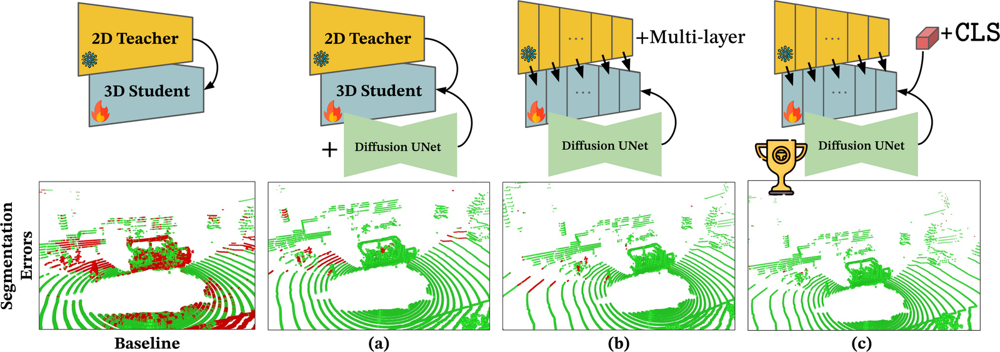
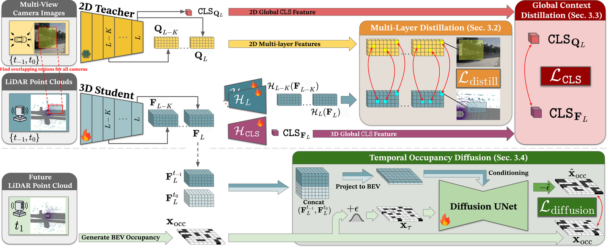
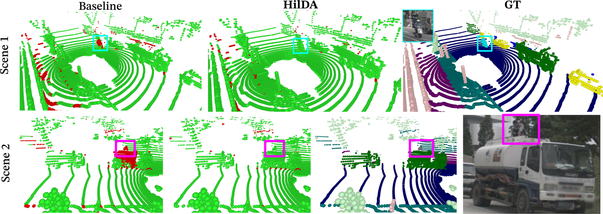
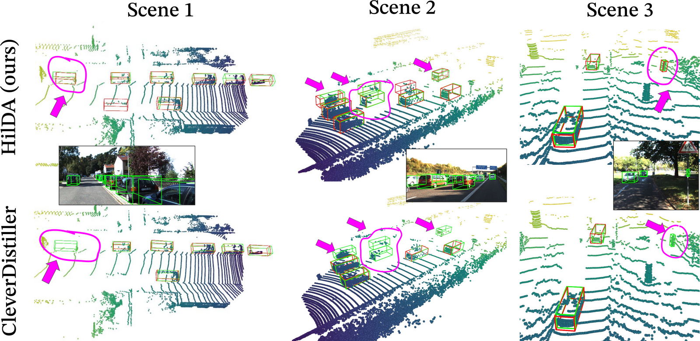
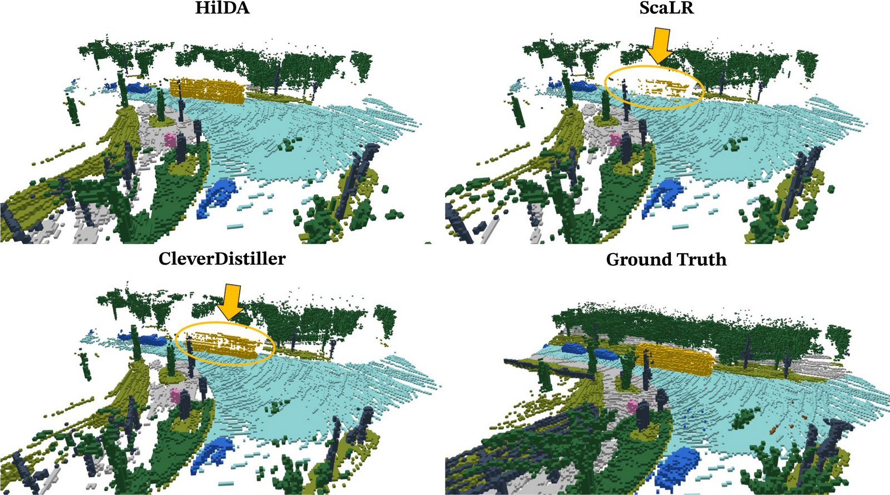
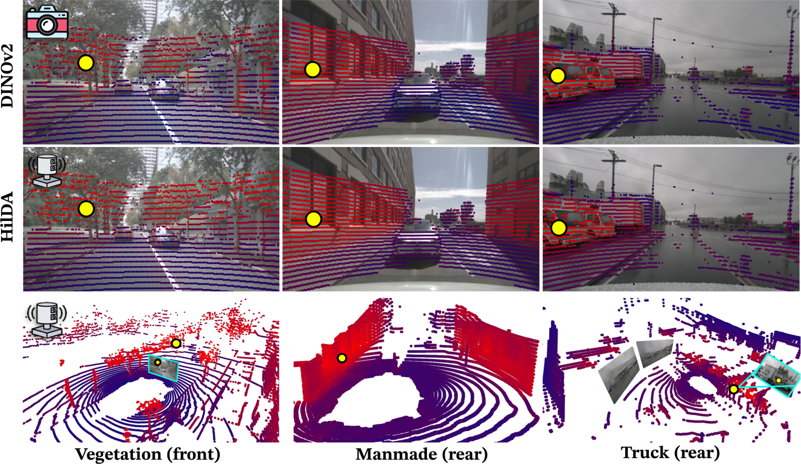
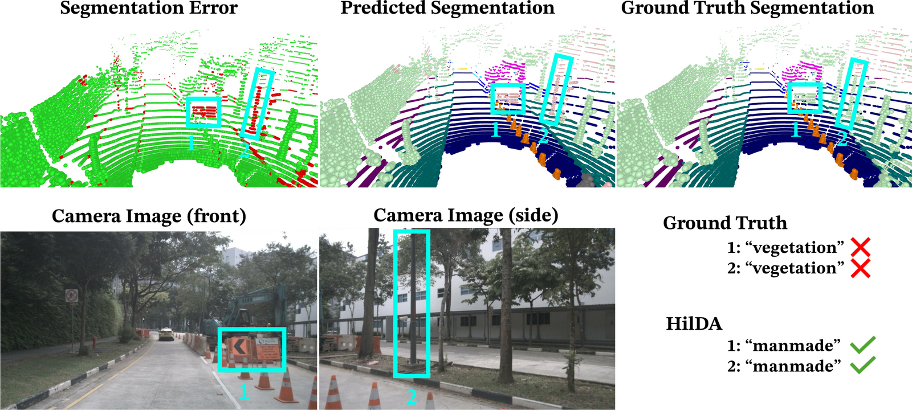

<div align="center">

# HilDA: Hierarchical Distillation with Diffusion<br>for Advancing Self-Supervised LiDAR Pre-training

<p>
  <a href="https://arxiv.org"></a>
  <a href="https://arxiv.org"></a>
  <a href="https://github.com"></a>
  <a href="https://nerfies.github.io"></a>
</p>


**Maciej Wozniak**<sup>1,*</sup> &nbsp;·&nbsp; **Jesper Ericsson**<sup>1,3,*</sup> &nbsp;·&nbsp; **Hariprasath Govindarajan**<sup>2</sup> &nbsp;·&nbsp; **Truls Nyberg**<sup>1,3</sup><br>
**Thomas Gustafsson**<sup>3</sup> &nbsp;·&nbsp; **Patric Jensfelt**<sup>1</sup> &nbsp;·&nbsp; **Olov Andersson**<sup>1</sup>

<sup>1</sup>KTH Royal Institute of Technology &nbsp; <sup>2</sup>Linköping University &nbsp; <sup>3</sup>TRATON AB / Scania<br>
<sub><sup>*</sup>Equal contribution · Links above are placeholders pending release</sub>

</div>

---

## Overview

Vision Foundation Models (VFMs) are powerful teachers for camera-to-LiDAR knowledge distillation, but current methods treat them as black boxes — distilling only the **final layer** and ignoring both the teacher's layer-wise semantic structure and the spatiotemporal information in LiDAR sequences.

**HilDA** is a self-supervised pre-training framework that captures both the semantic *what* and the geometric *where* needed for driving. It combines **hierarchical distillation** (multi-layer + global context) with a **temporal occupancy diffusion** objective.

<div align="center">
  
  <br><sub>Segmentation errors (red) progressively vanish as we add (a) temporal occupancy diffusion, (b) multi-layer distillation, and (c) global context (CLS) distillation.</sub>
</div>

## Method

<div align="center">
  
</div>

From LiDAR sweeps and synchronized multi-view images, a 3D backbone is trained end-to-end with three self-supervised objectives — **no task labels**:

| # | Component | What it does |
|---|-----------|--------------|
| **1** | **Multi-Layer Distillation** | Aligns *multiple* teacher layers with student layers via calibrated point–pixel correspondences, transferring *how* features form across the hierarchy. |
| **2** | **Global Context Distillation** | Aligns the VFM's **CLS token** with a learnable 3D global-context token, injecting scene-level semantics. |
| **3** | **Temporal Occupancy Diffusion** | A conditional diffusion model denoises **future BEV occupancy** from past + present features, teaching object permanence and scene dynamics. |

The distillation and diffusion heads are discarded at inference — only the pre-trained backbone transfers to all downstream tasks, with no re-pretraining.

## Results

HilDA sets a new state of the art on camera–LiDAR cross-modal distillation and transfers strongly to spatial and spatiotemporal 3D tasks.

### Semantic Segmentation
<div align="center">
  
  <br><sub>Fewer errors than ScaLR; correctly segments rare long-tail cases (scooter driver, person on a truck).</sub>
</div>

### 3D Object Detection
<div align="center">
  
  <br><sub>Robust detections at long range and under heavy occlusion, where prior distillation baselines miss objects.</sub>
</div>

### Semantic Occupancy
<div align="center">
  
  <br><sub>Cleaner, more complete semantic occupancy than ScaLR / CleverDistiller; highest mIoU across a 5-second horizon.</sub>
</div>

### Cross-Modal Feature Alignment
<div align="center">
  
  <br><sub>HilDA's 3D feature similarity (bottom) closely matches DINOv2's 2D pattern — strong cross-modal alignment.</sub>
</div>

### Recovering Annotation Errors
<div align="center">
  
  <br><sub>Ground truth mislabels a light pole and signs as "vegetation"; HilDA correctly predicts "manmade".</sub>
</div>

## Project Page

The full interactive page lives in this folder. To preview locally:

```bash
python3 -m http.server 8000
# open http://localhost:8000
```

To publish via **GitHub Pages**, push this folder to a repository and enable Pages on the branch root.

## Citation

```bibtex
@inproceedings{wozniak2026hilda,
  title     = {HilDA: Hierarchical Distillation with Diffusion for
               Advancing Self-Supervised LiDAR Pre-training},
  author    = {Wozniak, Maciej and Ericsson, Jesper and
               Govindarajan, Hariprasath and Nyberg, Truls and
               Gustafsson, Thomas and Jensfelt, Patric and Andersson, Olov},
  booktitle = {European Conference on Computer Vision (ECCV)},
  year      = {2026}
}
```

<sub>Website template adapted from <a href="https://nerfies.github.io/">Nerfies</a>.</sub>
